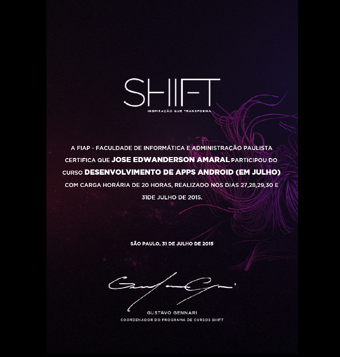

# José Edwanderson do Amaral

Olá! 
Eu sou José, um Desenvolvedor com experiência em criar soluções no ramo Industrial, principalmente focadas em back-end e integração de sistemas. Tenho um forte background em Java e Spring Boot, além de habilidades em desenvolvimento Android e gerenciamento de bancos de dados.

## 🛠️ Competências Técnicas

- **Back-End:** Java, Spring Boot, JSF (PrimeFaces)
- **Mobile:** Desenvolvimento Android
- **Banco de Dados:** MySQL, PostgreSQL, Oracle
- **Ferramentas e Outros:** Docker, Git, Jenkins

## 🚀 Projetos Recentes

### 🔒 MRP Integration Project
Sistema de integração MRP com módulos de Engenharia, Produção, Estoque e Comercial.

### 🔒 ERP Application
Aplicação ERP completa desenvolvida com Java Spring Boot.

## 🏢 Experiência Profissional

- **Monteferro América Latina**:
  - **Gerente de TI** (Maio 2023 - Presente)
  - **Supervisor de Sistemas** (Setembro 2019 - Junho 2023)
  - **Analista de Sistemas** (Março 2019 - Setembro 2019)

## ⚡ Tecnologias Utilizadas

## 📊 Estatísticas do GitHub

## 🔥 Contribuições Recentes

## 📈 Linguagens Mais Utilizadas

## 🎓 Formação

- **Ciência da Computação** - Universidade Cruzeiro do Sul

## 🚀 [Certificações](./certificates/README.md)

- ###  [Alura](https://cursos.alura.com.br/user/jedwanderson/fullCertificate/bfbc7d1cc1e8935af3a182cffc3078ac)

  
  
  

- ###  [Alura Shift-Android](./certificates/certificate_android_shift.png)

  

- ###  [DIO](https://www.dio.me/users/andersonlinker)
> #### Claro - Java com Spring Boot

